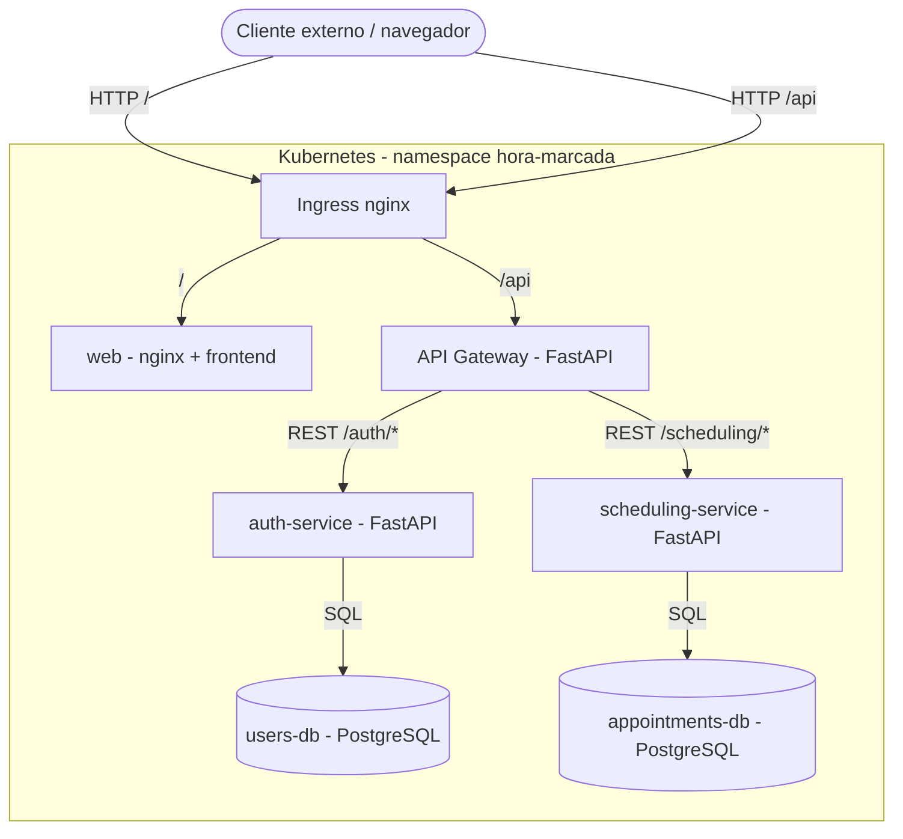

# Arquitetura

O **Hora Marcada** adota arquitetura de microsservicos. Cada componente e um
container independente; a comunicacao e feita por **APIs REST** e o acesso
externo e intermediado por um **API Gateway**.

## Componentes

### Aplicacao Web (`web`)
Servida por nginx (imagem nao-privilegiada). Entrega HTML/CSS/JS e consome a API
no caminho relativo `/api`. Toda chamada de API passa pelo API Gateway.

### API Gateway (`api-gateway`)
- Ponto unico de entrada para clientes externos.
- Valida o token JWT na borda (autenticacao).
- Aplica **rate limiting** (mitigacao de DoS e forca-bruta).
- Roteia para os servicos internos: `/api/auth/*` e `/api/scheduling/*`.
- Adiciona cabecalhos de seguranca.

### Servico de Autenticacao (`auth-service`)
- `POST /register` (RF01, incluindo WhatsApp), `POST /login` (RF02 -> JWT),
  `GET /me`, `GET /users` (admin).
- Hash de senha com **bcrypt**, tokens **JWT** (HS256), perfis `cliente`/`admin`.
- Persiste no `users-db`.

### Servico de Agendamento (`scheduling-service`)
- Horarios: `GET /slots` (RF03), `POST /slots` (RF07), `PUT /slots/{id}` (RF08),
  `DELETE /slots/{id}` (RF09).
- Funcionamento: `GET /working-hours` e `POST /working-hours` (admin). A regra
  gera a agenda dos proximos 12 meses, sem domingos.
- Agendamentos: `POST /appointments` (RF04), `DELETE /appointments/{id}` (RF05),
  `GET /appointments/me`, `GET /appointments` (RF10, admin).
- Valida o JWT localmente (defesa em profundidade) e persiste no `appointments-db`.

### Bancos de dados
`users-db` e `appointments-db` sao instancias independentes de PostgreSQL 16,
implantadas como StatefulSets com volume persistente.

## Comunicacao REST (principais endpoints via Gateway)

| Metodo | Rota (atraves do Gateway) | Servico | Requisito |
|---|---|---|---|
| POST | `/api/auth/register` | auth | RF01 |
| POST | `/api/auth/login` | auth | RF02 |
| GET | `/api/scheduling/slots` | scheduling | RF03 |
| POST | `/api/scheduling/appointments` | scheduling | RF04 |
| DELETE | `/api/scheduling/appointments/{id}` | scheduling | RF05 |
| POST | `/api/scheduling/slots` | scheduling | RF07 |
| PUT | `/api/scheduling/slots/{id}` | scheduling | RF08 |
| DELETE | `/api/scheduling/slots/{id}` | scheduling | RF09 |
| GET | `/api/scheduling/working-hours` | scheduling | RF07 |
| POST | `/api/scheduling/working-hours` | scheduling | RF07 |
| PUT | `/api/scheduling/admin/appointments/{id}/confirm` | scheduling | RF10 |
| DELETE | `/api/scheduling/appointments/{id}` | scheduling | RF05 |
| DELETE | `/api/scheduling/admin/appointments/{id}` | scheduling | RF10 |
| GET | `/api/scheduling/appointments` | scheduling | RF10 |

## Decisoes de projeto

- **FastAPI**: framework apresentado em aula para APIs REST; rapido e com
  validacao nativa (Pydantic).
- **PostgreSQL**: SGBD relacional robusto, com bom suporte a Kubernetes.
- **Segredo JWT compartilhado**: gateway e servicos validam o mesmo token,
  permitindo defesa em profundidade.
- **Alta disponibilidade**: servicos sem estado rodam com 2 replicas (Deployments)
  e podem escalar via HorizontalPodAutoscaler.
