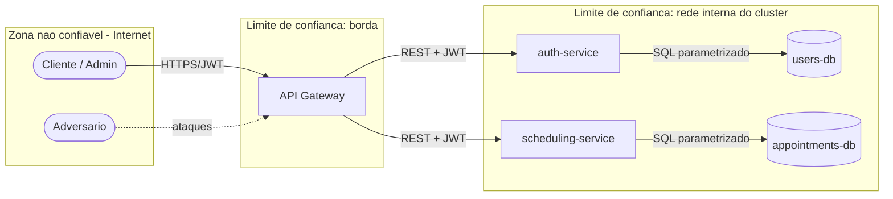

# Modelo de Ameacas (STRIDE)

Este documento descreve o modelo do adversario do **Hora Marcada**, separando as
ameacas em dois dominios: **aplicacao** e **infraestrutura/implantacao** (incluindo
CI/CD e Kubernetes). Para cada ameaca apresentamos a mitigacao implementada.

## Diagrama de Fluxo de Dados (DFD)

Ativos criticos: credenciais de usuarios, tokens JWT, dados de agendamento,
segredos (JWT_SECRET, senhas de banco).

## STRIDE - Aplicacao

| Categoria | Ameaca | Mitigacao implementada |
|---|---|---|
| **Spoofing** | Fingir ser outro usuario | Autenticacao JWT assinada (HS256) com expiracao; validacao do token no gateway e nos servicos |
| **Tampering** | Alterar horarios/agendamentos de terceiros | RBAC (cliente/admin); checagem de propriedade no cancelamento; validacao Pydantic; ORM |
| **Repudiation** | Negar acoes realizadas | Logs de auditoria (login, cadastro, criacao/cancelamento) via modulo `logging` (RNF07) |
| **Information Disclosure** | Vazamento de senhas/dados | Senhas com hash bcrypt; mensagens de erro genericas no login (anti-enumeracao); Secrets criptografados |
| **Denial of Service** | Sobrecarga por excesso de requisicoes | Rate limiting no gateway (global e login); replicas + HPA; limites de recursos por Pod |
| **Elevation of Privilege** | Cliente acessar funcoes de admin | Perfil definido apenas no servidor; cadastro nunca cria admin; `require_admin` nos endpoints sensiveis |

Protecoes adicionais: validacao de entrada (Pydantic) e ORM mitigam **SQL Injection**;
o frontend insere dados via `textContent` (nunca `innerHTML`) e o backend envia
cabecalhos `X-Content-Type-Options`, `X-Frame-Options` e `Content-Security-Policy`,
mitigando **XSS** (RNF09).

## STRIDE - Infraestrutura e Implantacao (modelo do adversario na implantacao)

Consideramos um adversario que tenta comprometer o pipeline de CI/CD ou o cluster
Kubernetes. As quatro principais ameacas tratadas:

| # | Ameaca na implantacao | Categoria | Mitigacao implementada |
|---|---|---|---|
| 1 | **Container comprometido escalando para o host/cluster** | Elevation of Privilege | Imagens **nao-root**; Pod Security Admission `restricted`; `securityContext` com `allowPrivilegeEscalation: false`, `drop ALL capabilities`, `readOnlyRootFilesystem`, `seccompProfile: RuntimeDefault` |
| 2 | **Movimento lateral entre Pods** (Pod comprometido acessando banco ou outro servico) | Tampering / Info. Disclosure | **NetworkPolicies** com negacao padrao de entrada e permissoes minimas (so o gateway fala com os servicos; so cada servico fala com seu banco) |
| 3 | **Leitura de Secrets no etcd** (JWT_SECRET, senhas de banco em texto claro) | Information Disclosure | **Criptografia de Secrets em repouso** no etcd (EncryptionConfiguration AES-CBC) |
| 4 | **Dependencia ou imagem vulneravel / segredo vazado no codigo** | Tampering / Info. Disclosure | **SCA** (Trivy, pip-audit, FOSSA) e **secret scanning** (Gitleaks) na pipeline; **SAST** (Bandit, Semgrep, CodeQL) aplicando o *shift-left* |

Medidas complementares de hardening:

- Imagens *slim* multi-stage com superficie de ataque reduzida e scan de imagens (Trivy) na entrega.
- Limites de CPU/memoria por Pod (contencao de impacto / DoS).
- Probes de readiness/liveness para resiliencia (alta disponibilidade).
- Segredos fora do codigo (ConfigMap vs Secret) e `.gitignore` para `.env`.

## Mapeamento ameaca -> arquivo

| Mitigacao | Onde |
|---|---|
| JWT + bcrypt | `services/auth-service/app/security.py` |
| RBAC | `require_admin` em `services/*/app/main.py` |
| Rate limiting | `services/api-gateway/app/main.py` |
| Pod Security / securityContext | `k8s/00-namespace.yaml`, `k8s/05..08-*.yaml` |
| NetworkPolicies | `k8s/10-network-policies.yaml` |
| Criptografia de Secrets | `k8s/encryption/` |
| SAST/SCA/secret scan | `.github/workflows/pipeline.yaml` |
